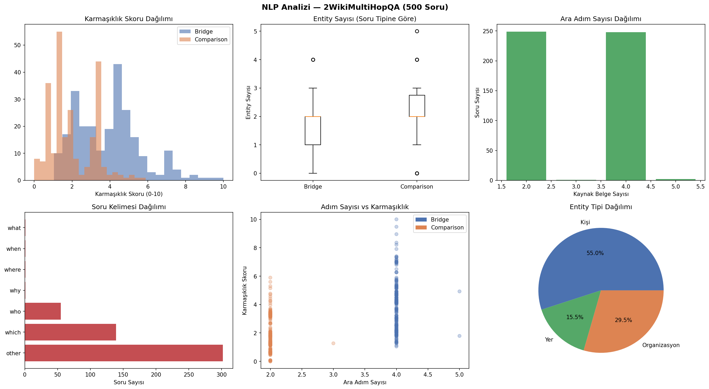
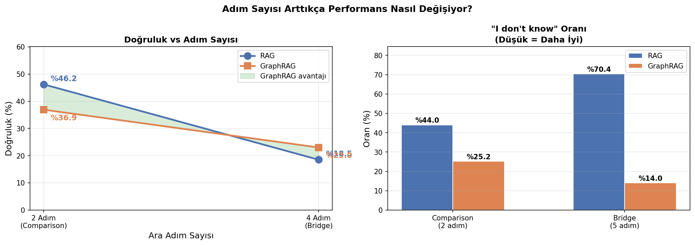
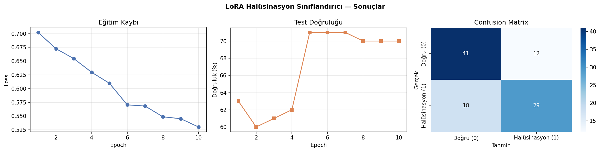

# Multi-Hop QA: Retrieval Strategy and Hallucination Prediction

A two-stage study on **2WikiMultihopQA** examining (1) how graph-structured retrieval changes LLM behaviour on multi-hop questions, and (2) whether question hallucination risk can be predicted *before* the model answers.

> **Course project — Graduate Seminar, Computer Engineering (MSc)**
> Author: [Arife Dal](https://github.com/arifedal)

---

## TL;DR

- Built a linguistic feature-extraction pipeline (NER, dependency parsing, triple extraction, a weighted complexity score) over 500 multi-hop questions.
- Compared **vector RAG** against **GraphRAG** (NetworkX knowledge graph + 2-hop traversal) using Llama-3.1-8B.
- **GraphRAG did not win on raw accuracy** (30.0% vs 32.6%) — but it cut refusal rate from **57.2% → 19.6%** and outperformed RAG on genuinely multi-hop (4-step) questions (23.0% vs 18.5%). The trade-off is the finding.
- Trained a **LoRA-adapted DistilBERT** classifier to predict which questions both systems would fail. Macro F1 **0.706**, beating Logistic Regression (0.667), TF-IDF-only (0.667) and Random Forest (0.580) — while training only **0.22% of model parameters**.

---

## Repository structure

```
.
├── rag-vs-graphrag/
│   ├── multihop_nlp_pipeline.ipynb
│   ├── results/                  # figures produced by the notebook
│   └── README.md
├── lora-hallucination/
│   ├── LoRA_Halusinasyon_Siniflandirma.ipynb
│   ├── results/
│   └── README.md
├── requirements.txt
├── .gitignore
└── README.md
```

The two stages are sequential: stage 2 uses the per-question error labels produced by stage 1.

---

## Stage 1 — NLP pipeline and retrieval comparison

### Data

[`2WikiMultihopQA`](https://huggingface.co/datasets/framolfese/2WikiMultihopQA) (167,454 training questions). A balanced subset of **500 questions** was sampled with a fixed seed: 250 `bridge_comparison` (4 reasoning steps) and 250 `comparison` (2 steps).

### Feature extraction (spaCy `en_core_web_sm`)

| Step | What it produces |
|---|---|
| Named Entity Recognition | person / location / organisation / date counts per question |
| Dependency parsing | verb, subordinate-clause, conjunction and preposition counts |
| Complexity score | weighted combination of the above, min-max normalised to 0–10 |
| Reasoning-step count | number of supporting-fact sentences the answer requires |
| Triple extraction | subject–relation–object triples from dependency trees |

Measured separation between question types:

| | `comparison` | `bridge_comparison` |
|---|---|---|
| Avg. reasoning steps | 2.00 | 4.01 |
| Avg. complexity score | 1.97 | 3.90 |



### The two retrieval systems

**RAG** — `all-MiniLM-L6-v2` embeddings, cosine similarity, top-3 passages, then Llama-3.1-8B (`temperature=0`) constrained to answer only from context.

**GraphRAG** — a directed knowledge graph is built per question from the context passages (articles and entities as nodes, extracted verb relations as edges). Question entities are located in the graph, a 2-hop neighbourhood is traversed, and the top 25 triples are passed to the LLM alongside the source passages as a hybrid context.

Answers are scored by **LLM-as-a-Judge** (semantic equivalence rather than string match), with explicit detection of refusals ("I don't know").

### Results (500 questions)

| Metric | RAG | GraphRAG |
|---|---|---|
| Overall accuracy | **32.6%** | 30.0% |
| Refusal rate ("I don't know") | 57.2% | **19.6%** |
| `comparison` (2-step) accuracy | **46.0%** | 36.8% |
| `bridge_comparison` (4-step) accuracy | 19.2% | **23.2%** |

Broken down by required reasoning steps (only bins with ≥10 samples shown; 2-step n=249, 4-step n=248):

| Steps | RAG | GraphRAG |
|---|---|---|
| 2 | **46.2%** | 36.9% |
| 4 | 18.5% | **23.0%** |




### Interpretation

Vector RAG is stronger on shallow comparison questions, where a single well-matched passage usually contains the answer. Its weakness is that it **abstains more than half the time** — when the answer is spread across passages, retrieval returns fragments and the model refuses.

GraphRAG reverses that: explicit entity relations give the model something to reason over, so it answers far more often and its advantage grows precisely where multi-hop reasoning is required. It pays for this with lower precision on easy questions, where graph noise can distract from an otherwise clean passage.

### Known limitations

- **Relation extraction is the bottleneck.** Triples are extracted with spaCy dependency parsing — fast and dependency-free, but shallow. It captures syntactic subject–verb–object structure rather than true semantic relations, so the resulting graph is noisier than one built with a dedicated relation-extraction model (REBEL, OpenIE) would be. This most likely caps GraphRAG's accuracy here.
- Single generator model (Llama-3.1-8B); results may not transfer to larger models.
- 500-question sample; the 3-step and 5-step bins had too few examples to report.
- LLM-as-a-Judge introduces its own error, though it is applied identically to both systems.

---

## Stage 2 — Predicting hallucination risk with LoRA

**Question:** given only a question's linguistic properties and text, can we predict *in advance* that a retrieval system will fail on it?

**Label:** `1` if **both** RAG and GraphRAG answered incorrectly (genuinely hard / high hallucination risk), `0` if at least one succeeded. Distribution: 266 / 234 — near-balanced. Split 400 train / 100 test, stratified.

**Architecture** — a hybrid model combining semantic and linguistic signal:

```
question text ──► DistilBERT + LoRA (r=8, α=16, q_lin & v_lin) ──► CLS (768)
                                                                       │
8 NLP features ──► Linear(8→64) + ReLU + Dropout ─────────────────► concat
                                                                       │
                                                    Linear(832→128→2) ─► label
```

Trainable parameters: **147,456 of 66,510,336 (0.22%)**. Trained 10 epochs, AdamW, lr 2e-4.

### Results (100 held-out questions)

| Model | Macro F1 |
|---|---|
| Random Forest (NLP features) | 0.580 |
| Logistic Regression (NLP features) | 0.667 |
| TF-IDF text only | 0.667 |
| **LoRA + DistilBERT + NLP features** | **0.706** |

Per-class, at 71% accuracy:

| Class | Precision | Recall | F1 | n |
|---|---|---|---|---|
| Correct answer (0) | 0.71 | 0.77 | 0.74 | 53 |
| Hallucination risk (1) | 0.71 | 0.64 | 0.67 | 47 |



The ablation matters more than the headline number: text alone and features alone both plateau at 0.667, and only their combination improves on it — the two signals are complementary rather than redundant.

Random Forest feature importances place **complexity score far ahead of everything else (0.578)**, followed by person-entity count (0.108) and verb count (0.071). Notably, the raw reasoning-step count ranks *last* (0.043): how hard a question is to parse predicts failure better than how many hops it nominally needs.

### Limitations

Small test set (n=100) — differences of a few points are within noise. Labels are derived from one generator model, so "hallucination risk" here means "risk for this pipeline", not a model-independent property.

---

## Running it

```bash
pip install -r requirements.txt
python -m spacy download en_core_web_sm
```

Stage 1 calls the Groq API. Set your key as an environment variable — never hard-code it:

```bash
export GROQ_API_KEY="your-key-here"
```

In Colab, use `google.colab.userdata` instead. Run `01-rag-vs-graphrag/` first; it writes the CSVs that `02-lora-hallucination/` consumes.

---

## Tech stack

`spaCy` · `NetworkX` · `Transformers` · `PEFT (LoRA)` · `PyTorch` · `sentence-transformers` · `scikit-learn` · `Groq API (Llama-3.1-8B)` · `pandas` · `matplotlib`
